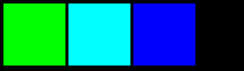
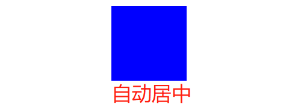
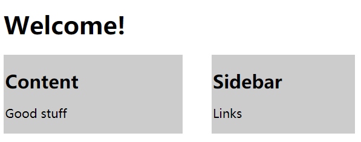
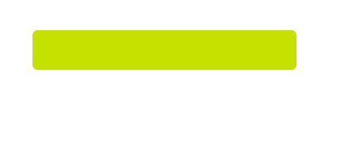

<center><font color=red size=6 face="Times New Roman">  Basic CSS</font></center><hr/>

<font color=blue size=5 face="华文中宋"> 1. 字体导入与设置</font>

***Problem Explanation***

The below example shows one of the ways in which you can import and use a Google Font.The example uses a link to the font’s API, in the <head> of the HTML document rather than in the CSS.
To browse through other fonts offered by Google, please check Google Fonts https://fonts.google.com/.
To look at what is going on behind a font, you can open the URL for the font.
We have used the Lobster font, click here 849 to have a look at what’s going on under-the-hood for the Lobster font

```js
<link href="https://fonts.googleapis.com/css?family=Lobster" rel="stylesheet" type="text/css">

<style>
  .red-text {
    color: red;
  }
  h2 {
    font-family: Lobster;
  }
  p {
    font-size: 16px;
    font-family: monospace;
  }
</style>

<h2 class="red-text">CatPhotoApp</h2>
<main>
  <p class="red-text">Click here to view more <a href="#">cat photos</a>.</p>
  
  <a href="#"></a>
  
  <div>
    <p>Things cats love:</p>
 
  </div>
  
```
<font color=blue size=5 face="华文中宋"> 2. Form 表单</font>
三个表单类型：
<ul>
 <li>radio
 <li>checkbox
 <li>text
 </ul>
 在"input"标签中可以添加属性checked，让他默认状态下就会选中。添加”value"属性表示被勾选后传递的值。
```js
<form action="/submit-cat-photo">
    <label><input type="radio" name="indoor-outdoor" value=“indoor” checked> Indoor</label>
    <label><input type="radio" name="indoor-outdoor"> Outdoor</label><br>
    <label><input type="checkbox" name="personality" checked> Loving</label>
    <label><input type="checkbox" name="personality"> Lazy</label>
    <label><input type="checkbox" name="personality"> Energetic</label><br>
    <input type="text" placeholder="cat photo URL" required>
    <button type="submit">Submit</button>
  </form>
  ```
  <font color=blue size=6 face="华文中宋"> 3. 多个classs属性重叠</font>
  我们已经给图片设置过了class name,并且设置好了相应属性，现在我们还要在图片上添加一个class name2并且添加相关属性！
  ```js
  .thick-green-border {
    border-color: green;
    border-width: 10px;
    border-style: solid;
  }
   .smaller-image {
    width: 100px;
   }

  
```

 <font color=blue size=6 face="华文中宋"> 4.  @media </font>
 利用@media属性可以让页面的显示适应浏览器的大小，我们缩放浏览器窗口的时候，也让浏览器展示的页面相应缩放！
```js
<style>
  :root {
    --penguin-size: 300px;
    --penguin-skin: gray;
    --penguin-belly: white;
    --penguin-beak: orange;
  }

  @media (max-width: 350px) {
    :root {
      /* Only change code below this line */
       --penguin-size: 200px;
       --penguin-skin: black;
      /* Only change code above this line */
    }
  }
  ```
<font color=blue size=6 face="华文中宋"> 5. a:hover伪类</font>
This challenge will touch on the usage of **pseudo-classes**. A pseudo-class is a keyword that can be added to selectors, in order to select a specific state of the element.
For example, the styling of an anchor tag can be changed for its hover state using the :hover pseudo-class selector. Here's the CSS to change the color of the anchor tag to red during its hover state:
```js
<style>
  a {
    color: #000;
    
  }
  a:hover{
    color:blue;
  }

</style>
<a href="http://freecatphotoapp.com/" target="_blank">CatPhotoApp</a>
```
>**div:hover + transform: scale(1.1);**
鼠标hover上去后，形状大小变换！
```js
<style>
  div {
    width: 70%;
    height: 100px;
    margin:  50px auto;
    background: linear-gradient(
      53deg,
      #ccfffc,
      #ffcccf
    );
  }
  div:hover{
    transform: scale(1.1);
  }


</style>

<div></div>
```


 <font color=blue size=6 face="华文中宋"> 6.  Position设置 </font>
 **1. 利用定位top right bottom left 这样会很准确但是麻烦**
 **2. 利用display属性快速横排**
 ```js
 <style>
  body {
    background-color: black;
  }

  .green {
    background-color:hsl(120, 100%, 50%);
  }

  .cyan {
    background-color: hsl(180, 100%, 50%);
  }

  .blue {
    background-color: hsl(240, 100%, 50%);
  }

  div {
    display: inline-block;
    height: 100px;
    width: 100px;
  }
</style>

<div class="green"></div>
<div class="cyan"></div>
<div class="blue"></div>
```

 **3. 利用margin属性**
 ```js
 <style>
  div {
    background-color: blue;
    height: 100px;
    width: 100px;
    margin:auto;

  }
</style>
<div></div>
```



 **4. 利用float属性**
  Floating elements are removed from the normal flow of a document and pushed to either the left or right of their containing parent element. It's commonly used with the width property to specify how much horizontal space the floated element requires.
  ```js
  <head>
  <style>
    #left {
      float:left;

      width: 50%;
    }
    #right {
      float:right;

      width: 40%;
    }
    aside, section {
      padding: 2px;
      background-color: #ccc;
    }
  </style>
</head>
<body>
  <header>
    <h1>Welcome!</h1>
  </header>
  <section id="left">
    <h2>Content</h2>
    <p>Good stuff</p>
  </section>
  <aside id="right">
    <h2>Sidebar</h2>
    <p>Links</p>
  </aside>
</body>
```

<font color=blue size=6 face="华文中宋">7. background:url()</font>
The background property supports the url() function in order to link to an image of the chosen texture or pattern. The link address is wrapped in quotes inside the parentheses.
```js
 <style>
  body {
    background:url("https://cdn-media-1.freecodecamp.org/imgr/MJAkxbh.png")

  }
</style>
```

<font color=blue size=6 face="华文中宋">8. animation方法</font>
利用animate方法来实现动图
```js
<style>
  div {
    height: 40px;
    width: 70%;
    background: black;
    margin: 50px auto;
    border-radius: 5px;
  }

  #rect {
    animation-name: rainbow;
    animation-duration: 4s;


  }
  @keyframes rainbow {
  0% {
    background-color: blue;
  }
  50% {
    background-color: green;
  }
  100% {
    background-color: yellow;
  }
}


</style>
<div id="rect"></div>
```
@keyframes is how to specify exactly what happens within the animation over the duration. This is done by giving CSS properties for specific "frames" during the animation, with percentages ranging from 0% to 100%.

**example 2**
和伪类：hover结合实现交互动效
```js
<style>
  button {
    border-radius: 5px;
    color: white;
    background-color: #0F5897;
    padding: 5px 10px 8px 10px;
  }

  button:hover {
    animation-name: background-color;
    animation-duration: 500ms;
  }
  @keyframes background-color {
    0% {
    background-color: blue;
  }
  
  100% {
    background-color: #4791d0;
  }
}


</style>

<button>Register</button>
```
