### ES6标准 

> 1. variables and strings
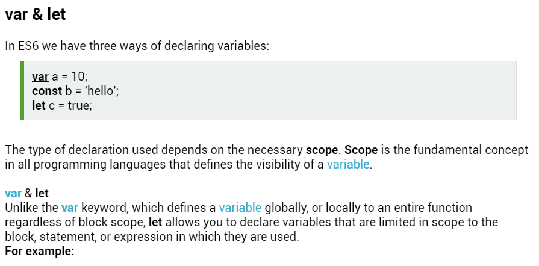
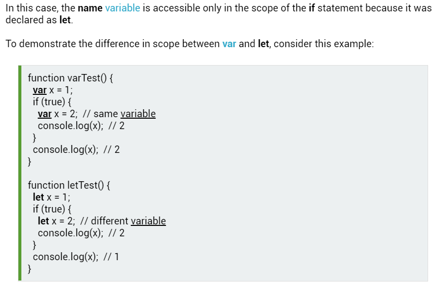
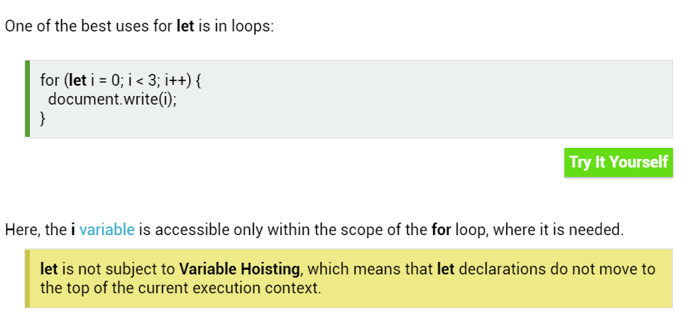
**example**
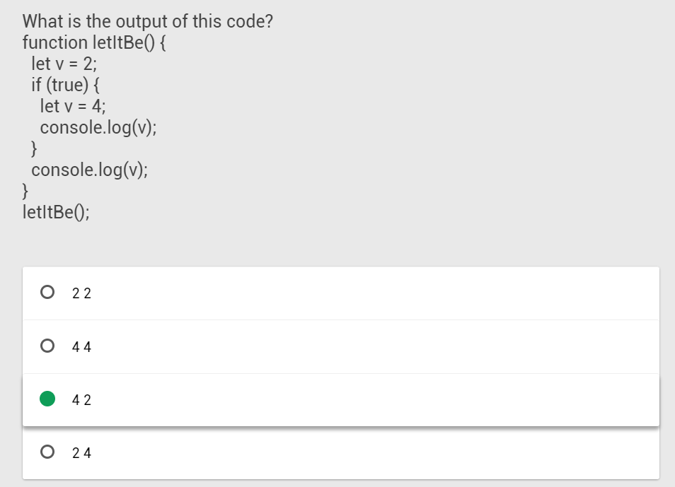
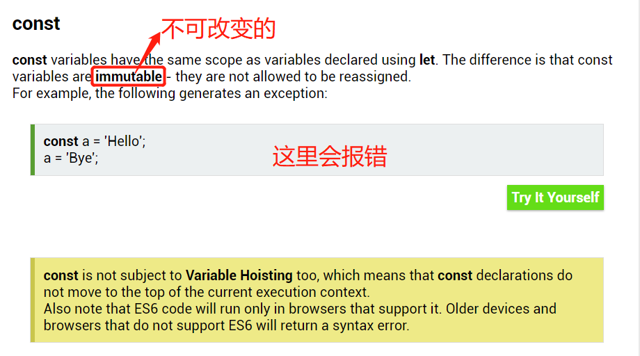
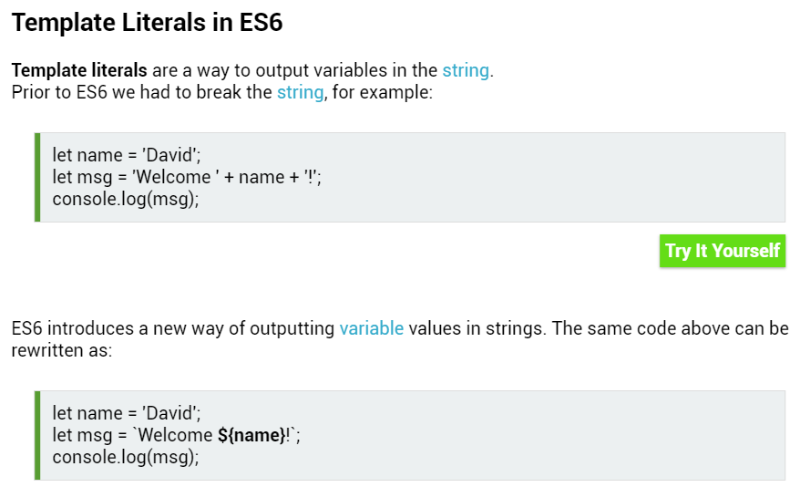
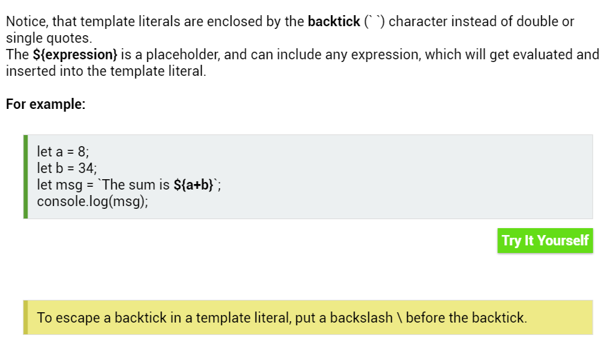

> 2. Loops in ECMAScript 6
In JavaScript we commonly use the for loop to iterate over values in a list:
```javascript
let arr = [1, 2, 3];
for (let k = 0; k < arr.length; k++) {
  console.log(arr[k]);
}
```
The for...in loop is intended for iterating over the enumerable keys of an object.
For example:
```javascript
let obj = {a: 1, b: 2, c: 3};
for (let v in obj) {
  console.log(v);
}
```

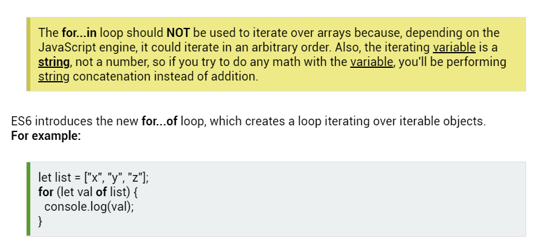
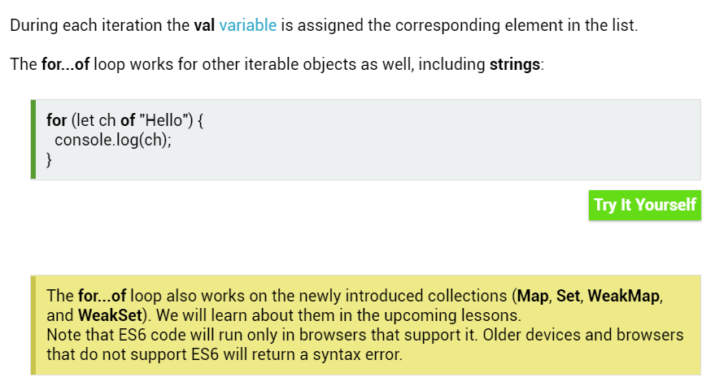
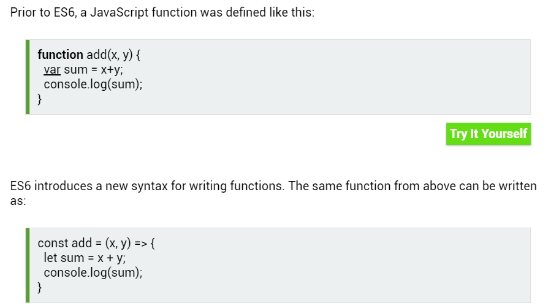
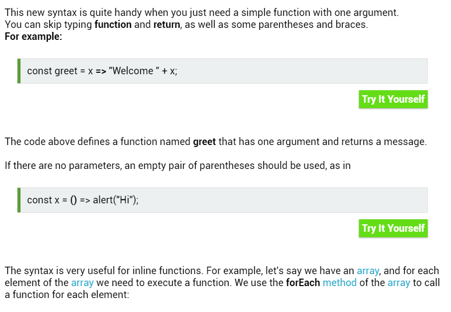
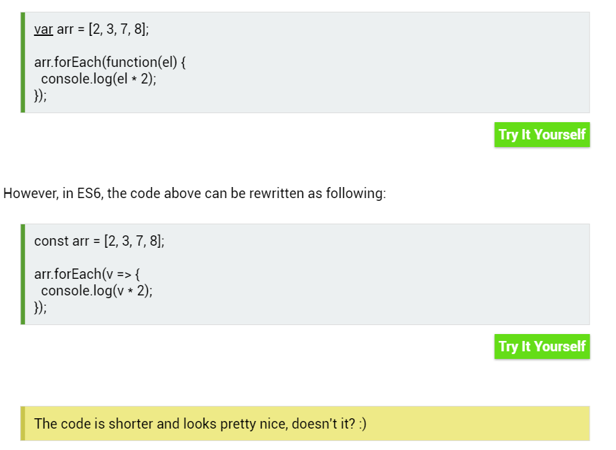
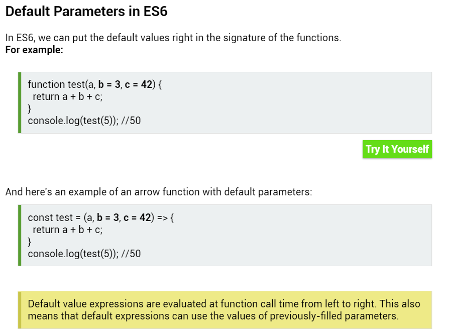
