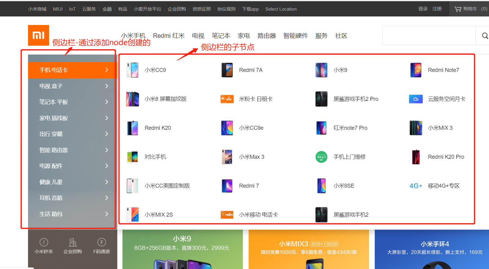

0. 通过ajax方法拿到需要的数据
1. 通过添加节点的办法创建侧边导航栏
```javascript
//侧边导航栏加载
    function leftNavDownload(){
        $.ajax({
            url: "../data/nav.json",
            success: function(data){
//第二部分，实现侧边导航栏
                var sideArr = data.sideNav;
                for(var i = 0; i < sideArr.length; i++){
                    var node = $(`<li class = 'category-item'>
                        <a href="/index.html" class = 'title'>
                            ${sideArr[i].title}
                            <em class = 'iconfont-arrow-right-big'></em>
                        </a>
                        <div class="children clearfix">
                            
                        </div>
                    </li>`);
                    node.appendTo("#J_navCategory #J_categoryList");
```

2. 取出子节点
```javascript

                    //取出其中的子节点
                    var childArr = sideArr[i].child;
                    var col = Math.ceil(childArr.length / 6);
                    node.find("div.children").addClass("children-col-" + col);
                    for(var j = 0; j < childArr.length; j++){
                        if(j % 6 == 0){
                            var newUl = $(`<ul class="children-list children-list-col children-list-col-${parseInt(j / 6)}"></ul>`);
                            newUl.appendTo(node.find("div.children"));
                        }
                        $(`<li>
                            <a href="http://www.mi.com/redminote8pro" data-log_code="31pchomeother001000#t=normal&amp;act=other&amp;page=home&amp;page_id=10530&amp;bid=3476792.2" class="link clearfix" data-stat-id="d678e8386e9cb0fb" onclick="_msq.push(['trackEvent', '81190ccc4d52f577-d678e8386e9cb0fb', 'http://www.mi.com/redminote8pro', 'pcpid', '31pchomeother001000#t=normal&amp;act=other&amp;page=home&amp;page_id=10530&amp;bid=3476792.2']);">
                                
                                <span class="text">${childArr[j].title}</span>
                            </a>
                        </li>`).appendTo(newUl);
                    }
                }
            }
        })
    }
```


3. 移入移出效果的添加
```javascript
//给侧片导航添加移入切换效果
    function leftNavTab(){
        $("#J_categoryList").on("mouseenter", ".category-item", function(){
            $(this).addClass("category-item-active");
        })
        $("#J_categoryList").on("mouseleave", "li.category-item", function(){
            $(this).removeClass("category-item-active");
        })
    }
```


    